# Manuel utilisateur - StockPilot AI / Gestion Stock

Version locale de demonstration.

## 1. Objectif de l'application

StockPilot AI est une application SaaS de gestion de stock pour TPE/PME. Elle permet de gerer les produits, les niveaux de stock, les mouvements, les fournisseurs, les commandes fournisseurs, les approbations, les notifications et les tableaux de bord decisionnels.

L'application est multi-tenant: chaque organisation voit uniquement ses propres donnees. Le proprietaire de la plateforme dispose d'un espace OWNER separe pour superviser les organisations clientes.

## 2. Lancer l'application

Depuis PowerShell:

```powershell
cd "C:\Users\simoD\OneDrive\Bureau\Gestion Stock"
.\start-stockpilot.ps1
```

Services attendus:

- Frontend: http://127.0.0.1:4200
- Backend: http://127.0.0.1:8081
- Service IA: http://127.0.0.1:8000/health

Smoke test:

```powershell
.\start-stockpilot.ps1 -SkipInstall -SmokeTestSeconds 5
```

## 3. Comptes de demonstration

### OWNER plateforme

| Role | Email | Mot de passe | Usage |
|---|---|---|---|
| OWNER | `owner@stockpilot.local` | `Owner@2026!` | Supervision SaaS, organisations, comptes demo, parametres legaux |

### Organisations clientes

Mot de passe commun:

```text
Password123!
```

| Organisation | ADMIN | USER |
|---|---|---|
| Demo Stock | `admin@demo-stock.local` | `user@demo-stock.local` |
| Garage Atlas | `admin@garage-atlas.local` | `mecano@garage-atlas.local` |
| Pharma Nova | `admin@pharma-nova.local` | `preparateur@pharma-nova.local` |
| Boutique Lumiere | `admin@boutique-lumiere.local` | `vendeur@boutique-lumiere.local` |
| Atelier Meca | `admin@atelier-meca.local` | `atelier@atelier-meca.local` |

## 4. Roles et permissions

### OWNER

Le role OWNER correspond au proprietaire de la plateforme SaaS.

Il peut:

- acceder a la console owner;
- voir les organisations clientes;
- consulter les volumes globaux: organisations, utilisateurs, produits, mouvements;
- consulter les comptes demo;
- gerer les informations legales de la plateforme.

Il ne sert pas a exploiter le stock quotidien d'une organisation cliente.

### ADMIN

Le role ADMIN correspond au responsable d'une organisation cliente.

Il peut:

- gerer les produits;
- gerer les stocks et mouvements;
- consulter le dashboard;
- gerer les fournisseurs;
- creer et suivre les commandes fournisseurs;
- valider les commandes selon les seuils;
- gerer les utilisateurs de son organisation;
- consulter les notifications, audits, rapports et vues decisionnelles;
- utiliser les ecrans IA existants.

### USER

Le role USER correspond a un utilisateur simple.

Il peut principalement:

- consulter le dashboard;
- consulter produits et stocks;
- creer certains mouvements si l'organisation l'autorise;
- consulter les alertes et rapports autorises.

Il ne voit pas les actions d'administration, les comptes demo, l'espace owner, les seuils, les audits globaux ou la gestion utilisateurs.

## 5. Connexion et inscription

### Connexion

Ouvrir:

```text
http://127.0.0.1:4200/login
```

Saisir l'email et le mot de passe d'un compte demo.

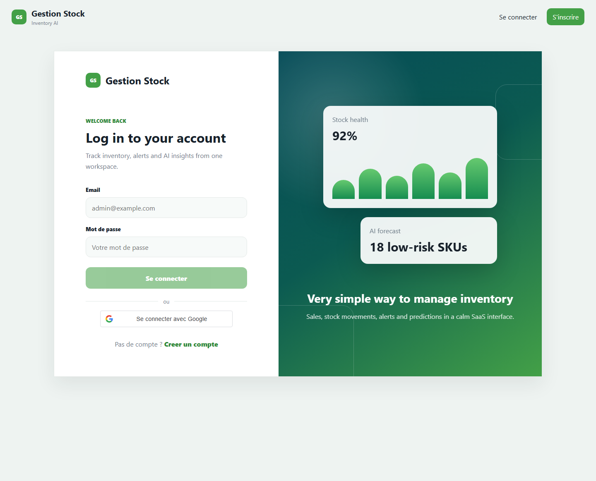

### Inscription

Ouvrir:

```text
http://127.0.0.1:4200/register
```

La creation de compte permet de creer une organisation. Apres la premiere connexion, l'organisation peut enrichir son profil: secteur, taille, adresse, devise, email d'alerte stock, delai fournisseur par defaut, site web et informations administratives.

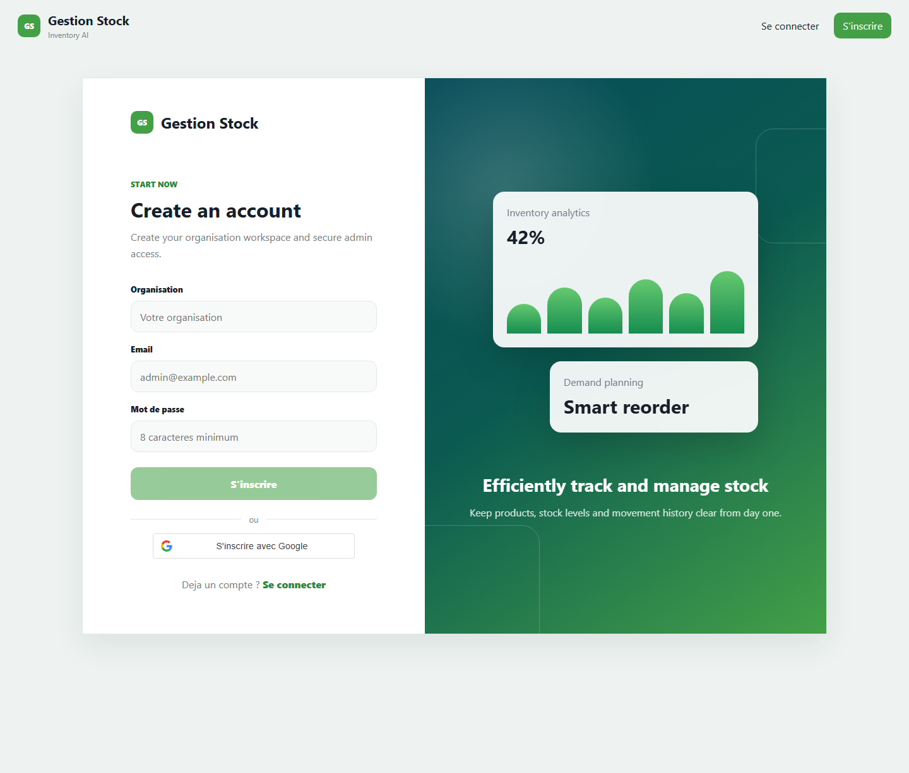

## 6. Espace OWNER

### Console owner

Route:

```text
/owner
```

La console owner donne une vue globale de la plateforme:

- nombre d'organisations;
- nombre d'utilisateurs;
- nombre de produits suivis;
- nombre de mouvements de stock;
- liste des organisations clientes;
- statut des organisations;
- volumes par organisation;
- administration legale.

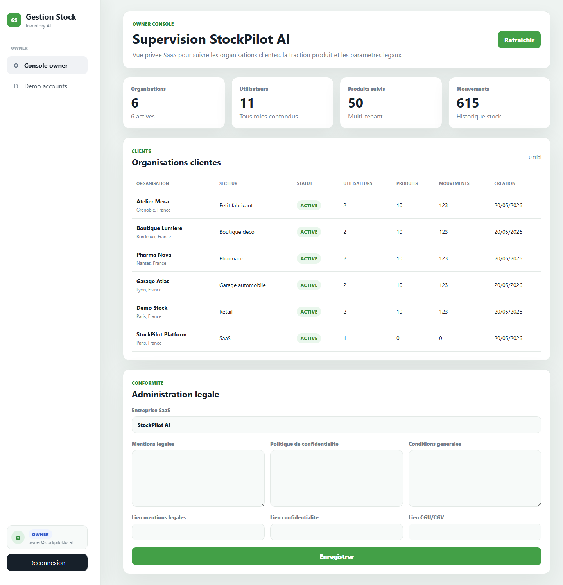

### Comptes demo

Route:

```text
/demo-accounts
```

Cette page est reservee au OWNER. Elle liste les comptes de demonstration disponibles pour tester les scenarios par secteur.

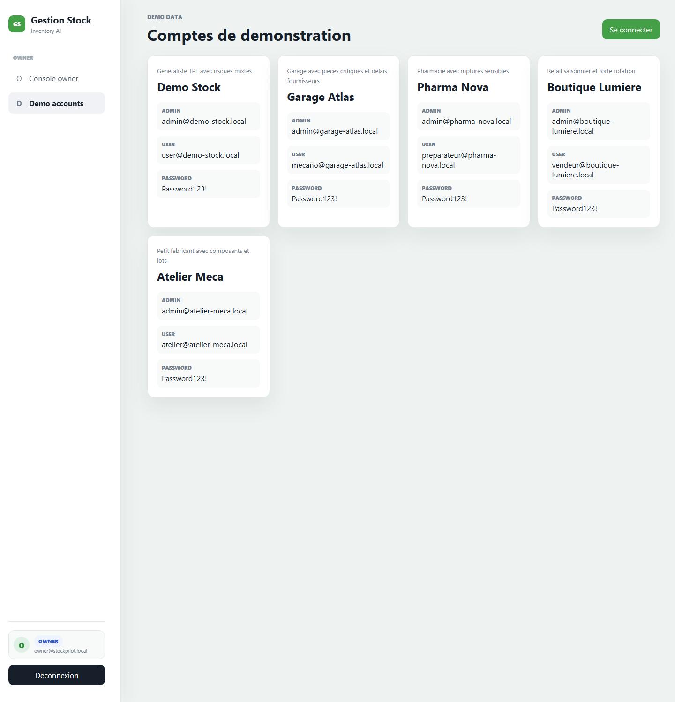

## 7. Dashboard organisation

Route:

```text
/dashboard
```

Le dashboard ADMIN/USER resume l'activite de l'organisation:

- nombre de produits;
- stocks critiques;
- alertes;
- commandes en attente;
- actions recommandees;
- raccourcis vers les modules metier.

Il sert de page d'accueil operationnelle.

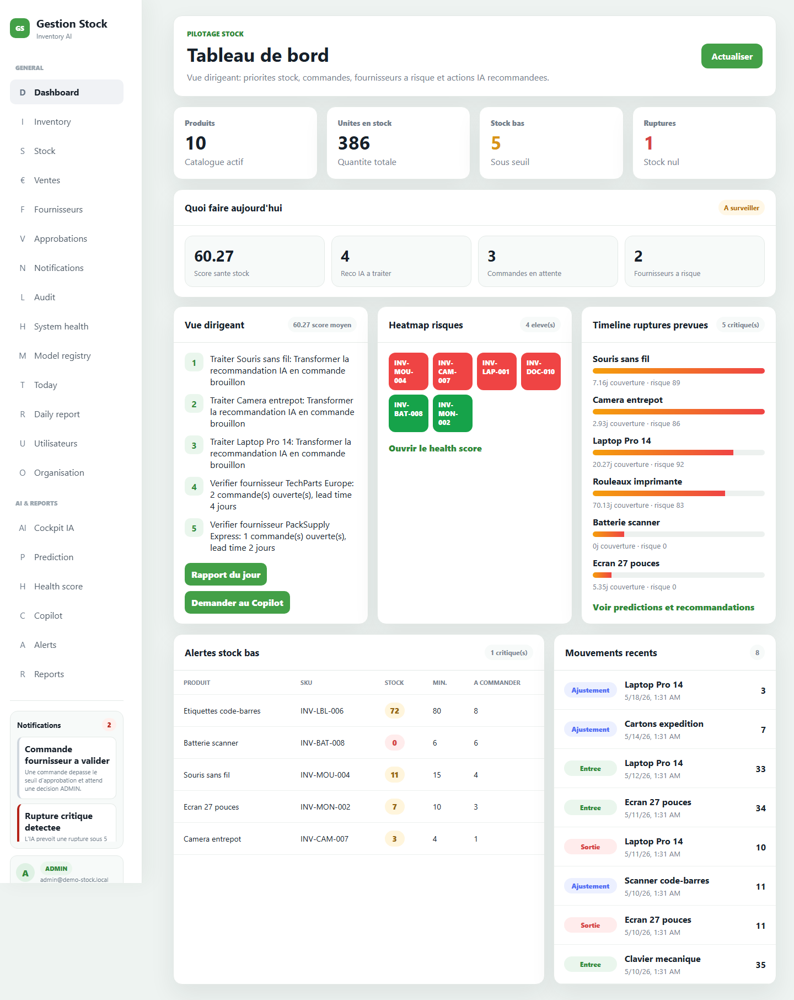

## 8. Produits

Route:

```text
/products
```

Fonctionnalites:

- afficher les produits de l'organisation;
- creer un produit;
- modifier un produit;
- supprimer un produit selon droits;
- gerer nom, SKU, categorie, unite, stock minimum;
- respecter l'unicite SKU par organisation.

Regles importantes:

- un produit appartient toujours a une organisation;
- deux organisations peuvent avoir le meme SKU;
- dans une meme organisation, le SKU doit etre unique.

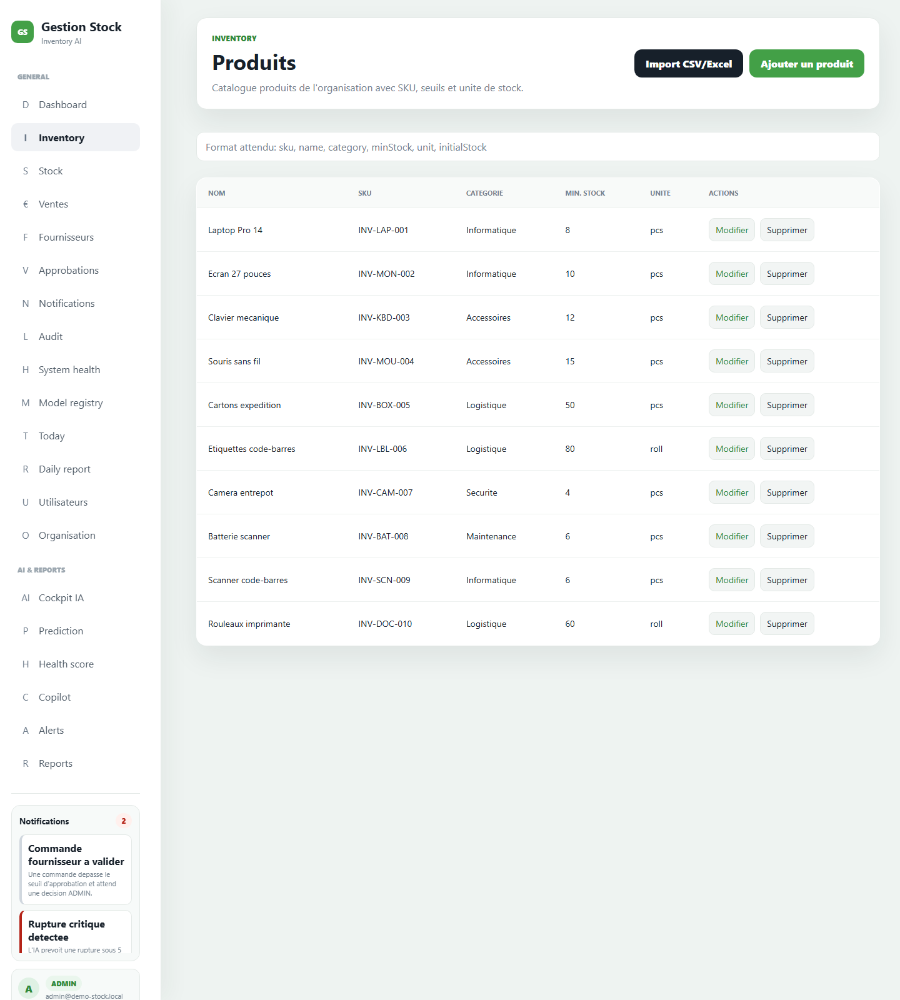

## 9. Stock et mouvements

Route:

```text
/stock
```

Fonctionnalites:

- consulter le stock courant par produit;
- visualiser les statuts: normal, stock bas, rupture;
- enregistrer une entree stock;
- enregistrer une sortie stock;
- faire un ajustement;
- consulter l'historique des mouvements.

Types de mouvements:

- `IN`: entree stock;
- `OUT`: sortie stock;
- `ADJUST`: ajustement inventaire.

Regles metier:

- le stock ne peut jamais devenir negatif;
- une sortie est refusee si la quantite disponible est insuffisante;
- chaque mouvement est historise;
- toutes les donnees sont filtrees par organisation.

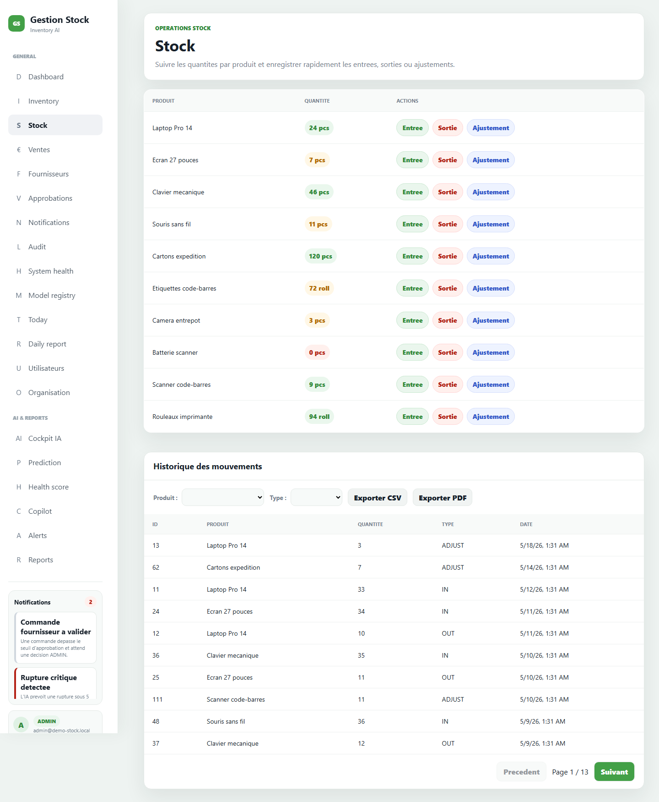

## 10. Ventes

Route:

```text
/sales
```

La page ventes permet de simuler ou suivre des sorties orientees vente. Elle complete les mouvements de stock et alimente les donnees de demande.

Fonctionnalites attendues dans l'ecran:

- enregistrer des ventes;
- suivre les sorties;
- alimenter les tendances de consommation;
- faciliter les projections de demande.

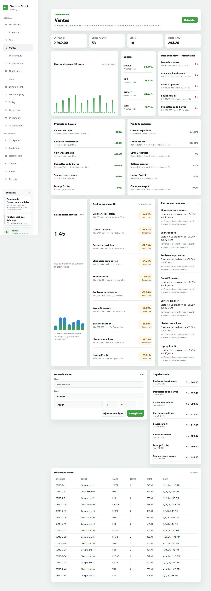

## 11. Fournisseurs et commandes

Route:

```text
/procurement
```

Cette page centralise les fournisseurs, les preferences produit-fournisseur et les commandes fournisseurs.

Fonctionnalites:

- creer un fournisseur;
- importer des fournisseurs;
- importer des commandes;
- exporter les donnees comptables;
- creer une commande fournisseur;
- choisir un fournisseur et un produit;
- definir quantite, cout unitaire et date prevue;
- definir un fournisseur prefere par produit;
- definir cout, minimum de commande et lead time;
- definir des SLA fournisseur;
- comparer les fournisseurs par produit.

La comparaison fournisseur utilise les criteres suivants:

- cout;
- lead time;
- fiabilite;
- taux de reception conforme;
- preference produit.

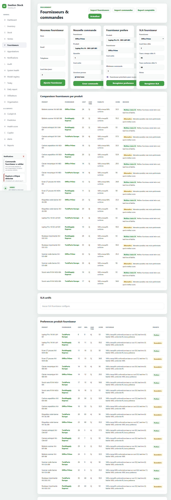

## 12. Centre d'approbation

Route:

```text
/approvals
```

Le centre d'approbation est reserve aux ADMIN.

Fonctionnalites:

- voir les commandes a valider;
- filtrer par montant, fournisseur, urgence ou risque;
- approuver une commande;
- refuser une commande;
- consulter le contexte de rupture ou recommandation liee.

Le seuil d'approbation est configurable par l'ADMIN. Une commande qui depasse ce seuil passe par le workflow d'approbation.

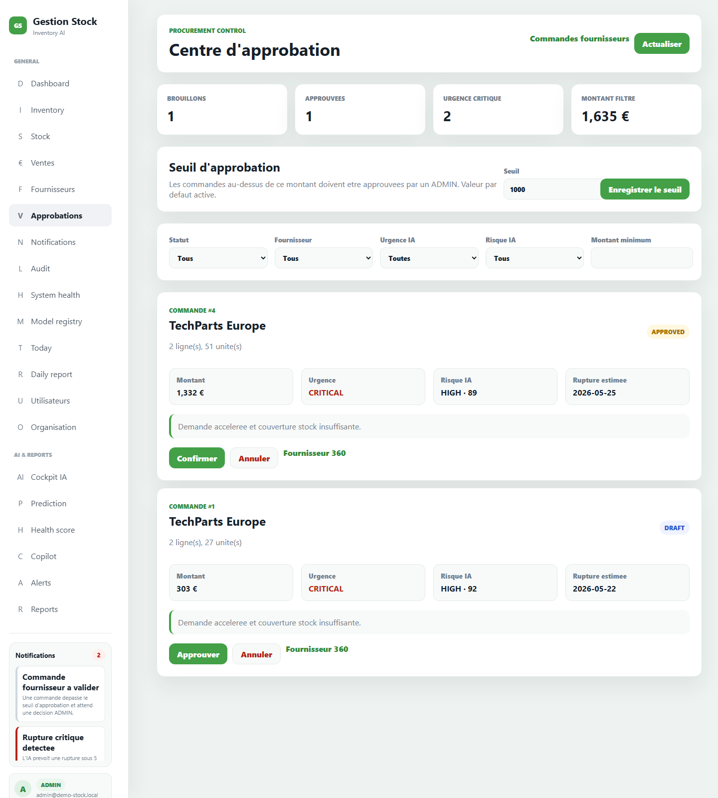

## 13. Centre de notifications

Route:

```text
/notifications
```

Fonctionnalites:

- afficher l'historique des notifications;
- filtrer les notifications;
- marquer comme lue;
- ouvrir une commande liee;
- ouvrir un fournisseur lie;
- consulter les alertes critiques.

Types de notifications:

- commande fournisseur a valider;
- rupture critique detectee;
- recommandation importante;
- evenement administratif.

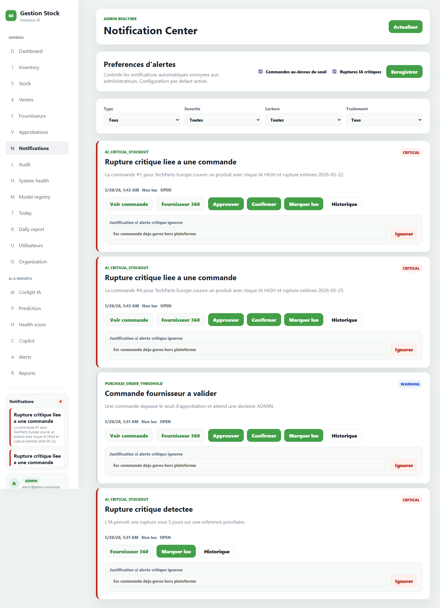

## 14. Audit de securite

Route:

```text
/security-audit
```

L'audit donne une trace exploitable des actions importantes.

Fonctionnalites:

- consulter les actions utilisateur;
- filtrer par date, acteur, module et severite;
- exporter en CSV;
- exporter en PDF;
- suivre les changements critiques: commandes, approbations, notifications, imports, seuils admin.

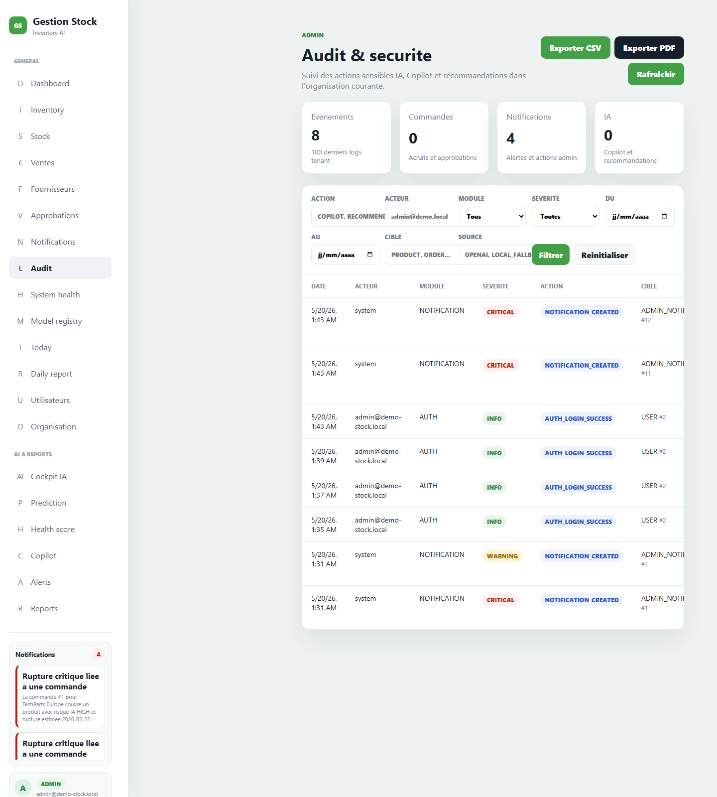

## 15. System health

Route:

```text
/system-health
```

Cette page donne une vision technique de l'etat de l'application.

Elle affiche:

- etat global;
- backend;
- service IA;
- dernier run IA;
- notifications admin non lues;
- volumes produits, stocks et commandes.

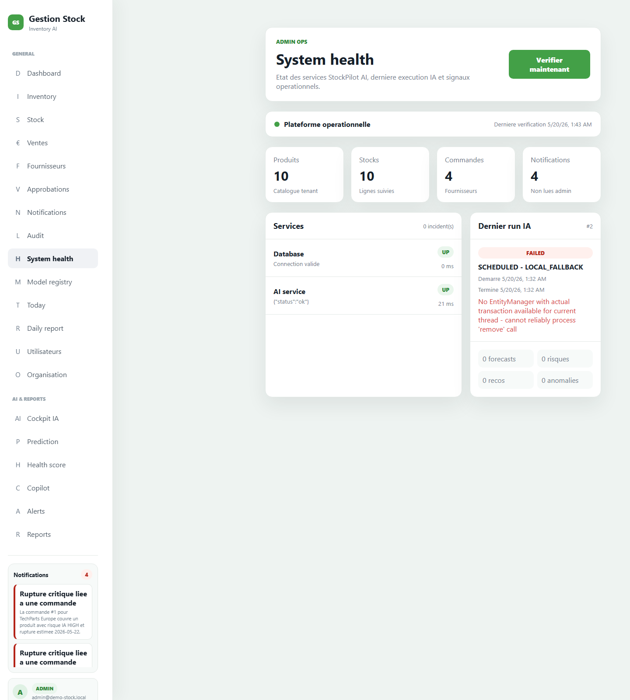

## 16. Timeline dirigeant

Route:

```text
/executive-timeline
```

La timeline dirigeant repond a la question:

```text
Que s'est-il passe aujourd'hui ?
```

Elle agrege:

- audits;
- notifications;
- commandes;
- risques de rupture;
- recommandations;
- actions prioritaires.

Elle sert de vue decisionnelle quotidienne.

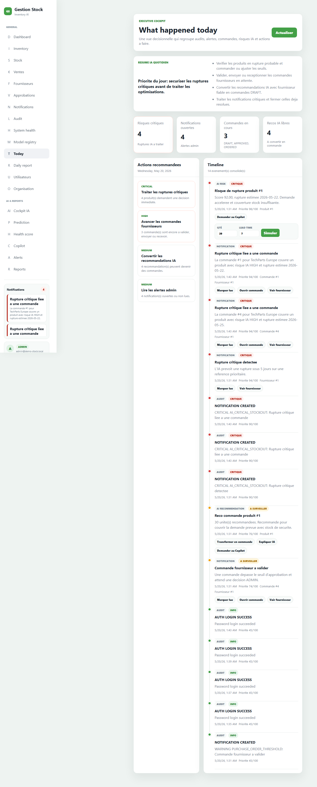

## 17. Daily report

Route:

```text
/daily-report
```

Le rapport quotidien permet de lire et exporter un resume operationnel.

Fonctionnalites:

- choisir une date;
- consulter le resume du jour;
- voir les decisions restantes;
- exporter CSV;
- exporter PDF.

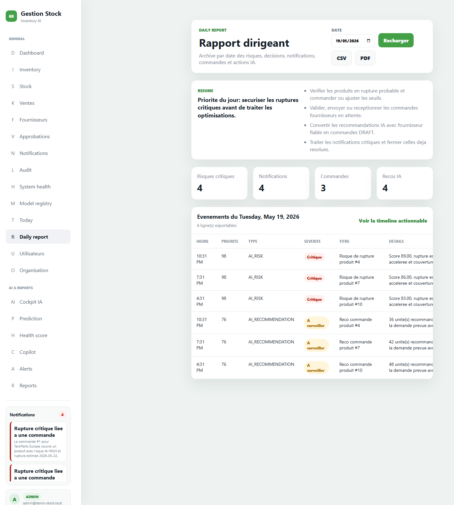

## 18. Utilisateurs organisation

Route:

```text
/users
```

Reserve aux ADMIN.

Fonctionnalites:

- lister les utilisateurs de l'organisation;
- creer un utilisateur ADMIN ou USER;
- modifier le role;
- activer/desactiver un compte;
- reinitialiser le mot de passe;
- consulter la derniere connexion.

Regles de securite:

- un ADMIN ne gere que les utilisateurs de son organisation;
- un utilisateur ne peut pas se desactiver lui-meme;
- les utilisateurs OWNER ne sont pas geres depuis cet ecran.

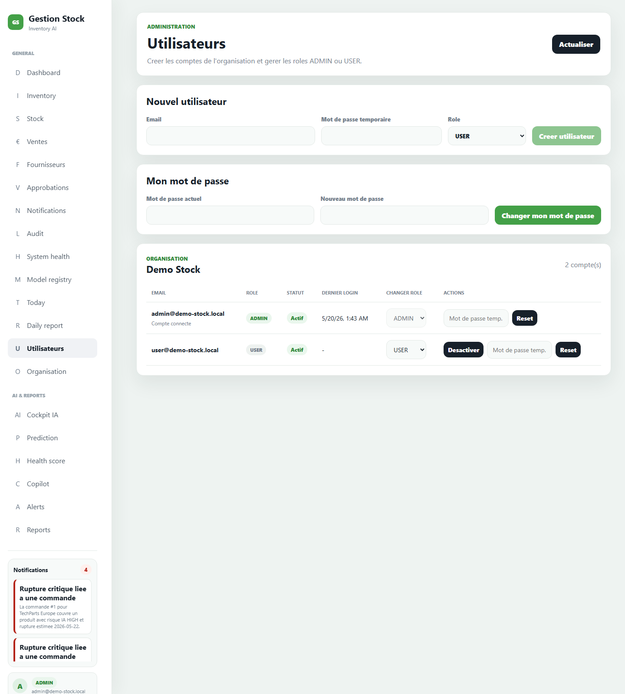

## 19. Cockpit IA

Route:

```text
/ai-dashboard
```

Le cockpit IA consolide les informations intelligentes disponibles.

Fonctionnalites:

- voir le nombre de produits critiques;
- voir les recommandations actives;
- voir les commandes en attente;
- transformer une recommandation en commande fournisseur;
- identifier les fournisseurs a probleme;
- consulter les insights automatiques.

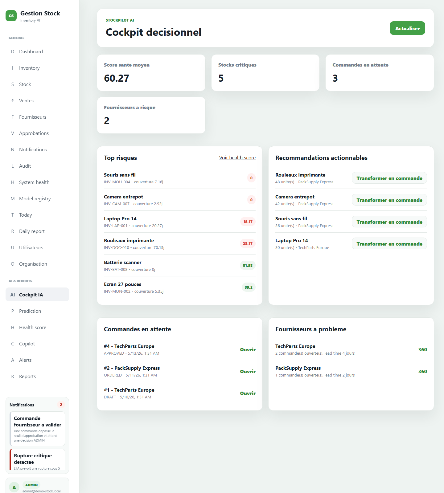

## 20. Predictions

Route:

```text
/prediction
```

Fonctionnalites:

- consulter les previsions a 7, 30 et 90 jours;
- comparer demande reelle et prevision;
- voir le modele gagnant par produit;
- detecter les divergences de demande;
- lancer ou suivre les runs IA.

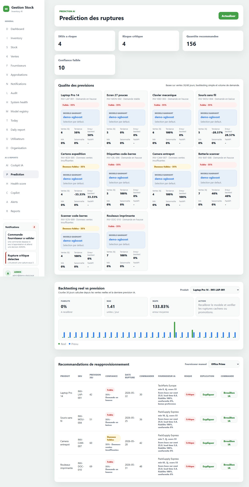

## 21. Stock Health Score

Route:

```text
/stock-health
```

Cette page donne un score de sante par produit.

Le score prend en compte:

- stock actuel;
- seuil minimum;
- demande moyenne;
- risque de rupture;
- couverture en jours;
- fournisseur associe;
- commande ouverte;
- action recommandee.

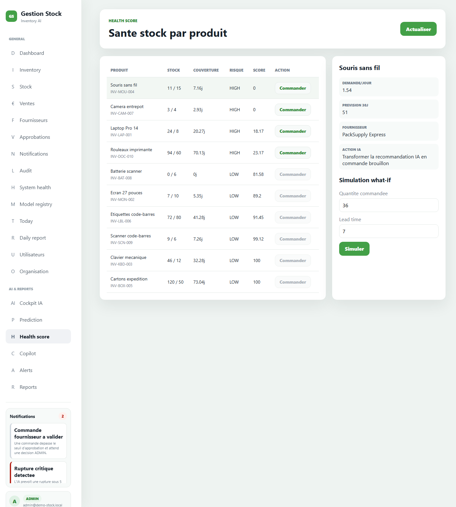

## 22. Copilot

Route:

```text
/copilot
```

Le Copilot permet de poser des questions sur le stock, les fournisseurs, les commandes et les risques.

Exemples de questions:

- Quels produits risquent la rupture ?
- Quel fournisseur pose probleme ?
- Pourquoi ce produit est-il critique ?
- Quelle commande dois-je prioriser aujourd'hui ?

Le Copilot affiche aussi des citations internes quand une reponse est liee a un produit, une commande, un fournisseur ou un mouvement.

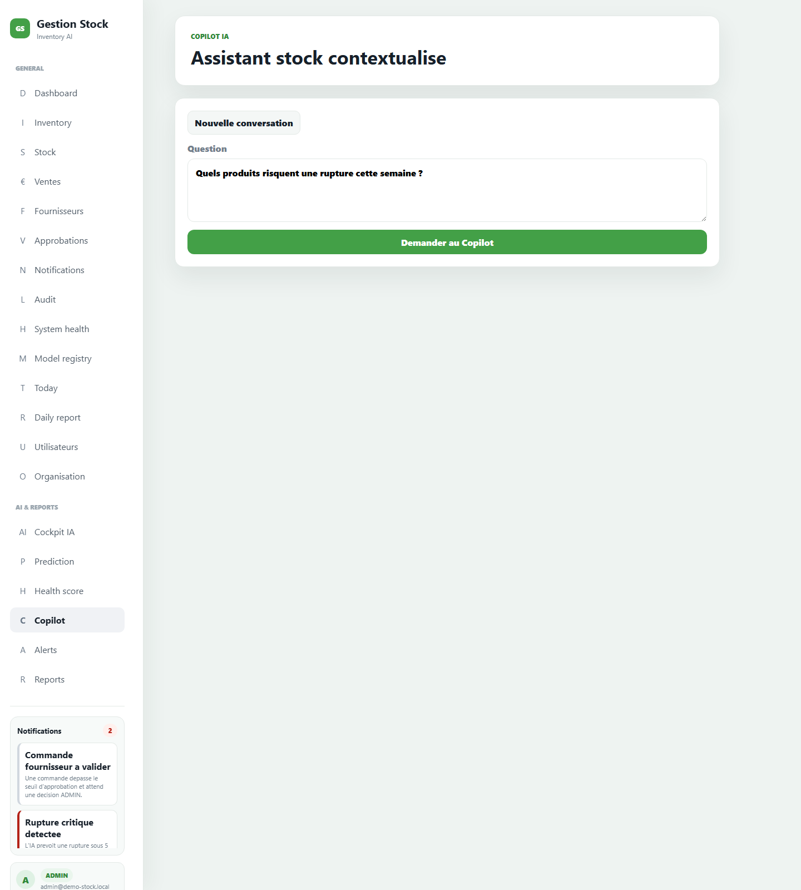

## 23. Alertes

Route:

```text
/alerts
```

Fonctionnalites:

- afficher les risques de rupture;
- visualiser les scores de risque;
- voir la date estimee de rupture;
- prioriser les actions.

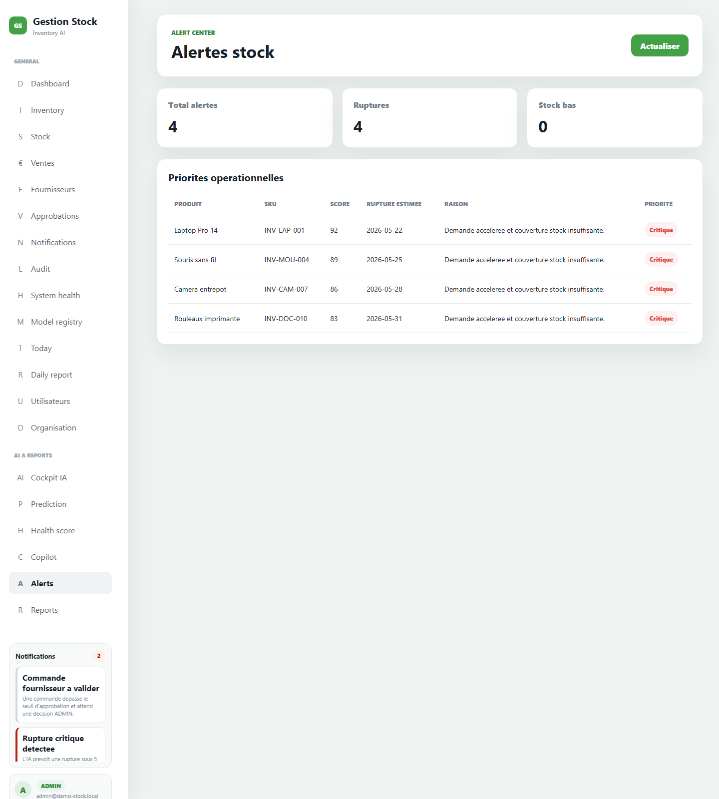

## 24. Reports

Route:

```text
/reports
```

La page rapports consolide les indicateurs analytiques.

Elle sert a comprendre:

- l'etat du stock;
- les tendances;
- les anomalies;
- les recommandations;
- les actions prioritaires.

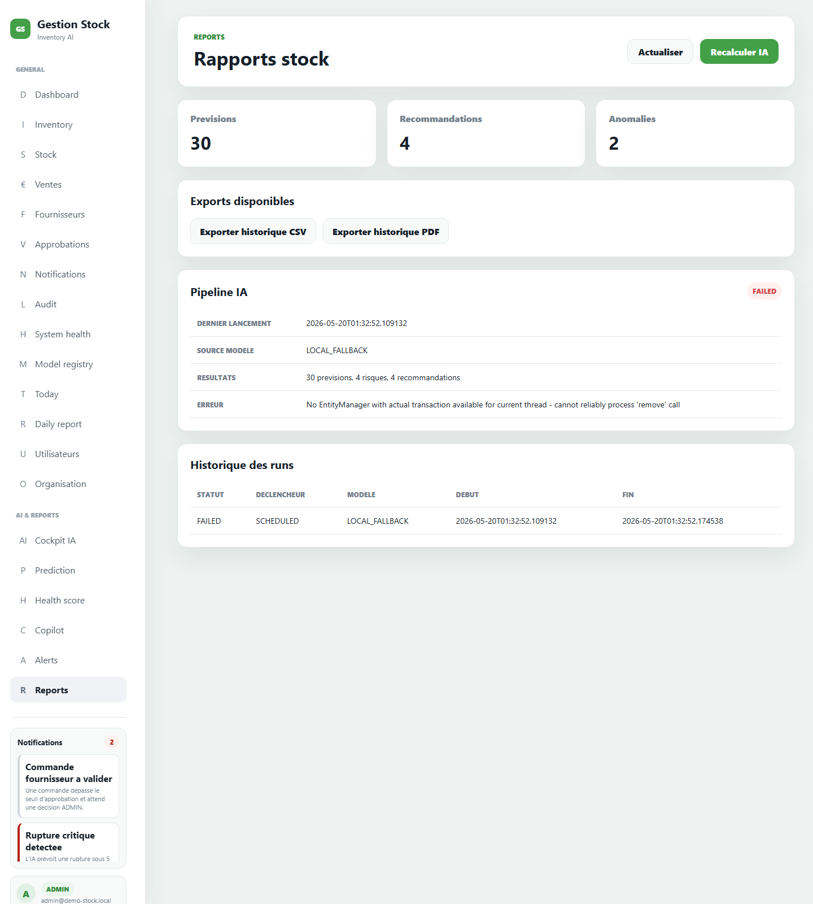

## 25. Model Registry

Route:

```text
/model-registry
```

Le registre modele suit la performance des modeles de prediction.

Fonctionnalites:

- voir les modeles disponibles;
- suivre l'erreur moyenne;
- voir les produits ou un modele gagne;
- identifier les produits a recalibrer.

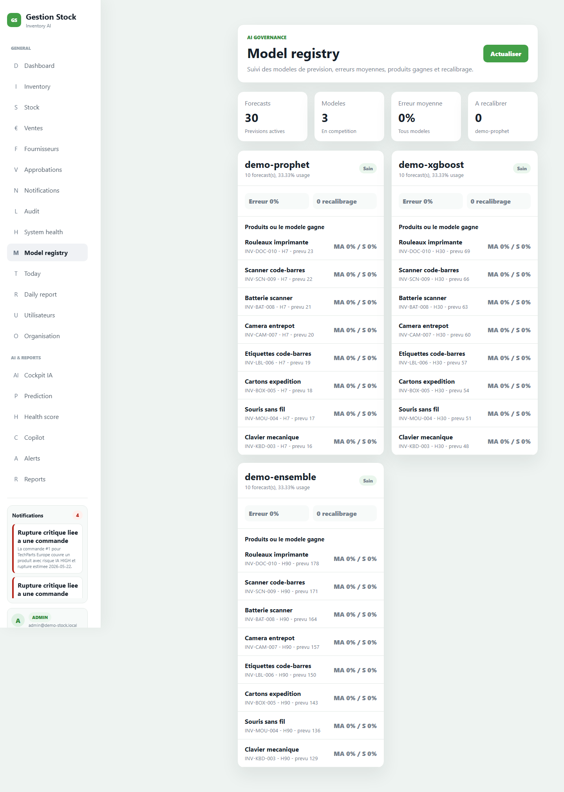

## 26. Fournisseur 360

Route exemple:

```text
/suppliers/1/360
```

La fiche fournisseur 360 donne une vue complete d'un fournisseur.

Elle affiche:

- historique commandes;
- fiabilite;
- cout moyen;
- retards;
- produits couverts;
- recommandations d'optimisation.

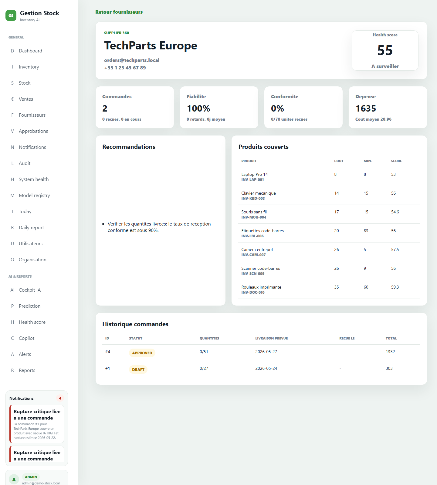

## 27. Workflows principaux

### Creer un produit

1. Se connecter en ADMIN.
2. Aller dans `Inventory`.
3. Cliquer sur `Ajouter un produit`.
4. Renseigner nom, SKU, categorie, stock minimum et unite.
5. Enregistrer.

Le SKU est unique uniquement dans l'organisation courante.

### Enregistrer une entree stock

1. Aller dans `Stock`.
2. Choisir le produit.
3. Utiliser l'action rapide `Entree`.
4. Renseigner la quantite.
5. Valider.

Un mouvement `IN` est cree et historise.

### Enregistrer une sortie stock

1. Aller dans `Stock`.
2. Choisir le produit.
3. Utiliser l'action rapide `Sortie`.
4. Renseigner la quantite.
5. Valider.

Si la quantite demandee est superieure au stock disponible, l'operation est refusee.

### Creer un fournisseur

1. Aller dans `Fournisseurs`.
2. Remplir le formulaire `Nouveau fournisseur`.
3. Renseigner nom, email, telephone et lead time.
4. Cliquer sur `Ajouter fournisseur`.

### Definir un fournisseur prefere

1. Aller dans `Fournisseurs`.
2. Utiliser la carte `Fournisseur prefere`.
3. Choisir le produit.
4. Choisir le fournisseur.
5. Renseigner cout, minimum de commande et lead time.
6. Cocher ou non fournisseur prioritaire.
7. Enregistrer.

### Creer une commande fournisseur

1. Aller dans `Fournisseurs`.
2. Utiliser `Nouvelle commande`.
3. Selectionner fournisseur et produit.
4. Saisir quantite, cout unitaire et livraison prevue.
5. Cliquer sur `Creer commande`.

La commande peut ensuite passer par le centre d'approbation selon le seuil configure.

### Transformer une recommandation IA en commande

1. Aller dans `Cockpit IA` ou `Stock Health`.
2. Identifier une recommandation.
3. Cliquer sur `Transformer en commande`.
4. Verifier fournisseur, quantite et justification.
5. Suivre la commande dans `Fournisseurs` ou `Approvals`.

### Approuver une commande

1. Aller dans `Approvals`.
2. Lire le contexte de la commande.
3. Approuver ou refuser.
4. L'action est historisee dans l'audit.

### Gerer les utilisateurs

1. Aller dans `Utilisateurs`.
2. Creer un compte avec email, mot de passe temporaire et role.
3. Modifier le role si necessaire.
4. Desactiver ou reinitialiser le mot de passe si besoin.

## 28. Import et export

Fonctionnalites disponibles ou preparees:

- import CSV/Excel produits et stock initial;
- import fournisseurs;
- import commandes;
- export comptable;
- export audit CSV;
- export audit PDF;
- export daily report CSV/PDF.

Bonnes pratiques:

- verifier les colonnes avant import;
- utiliser des SKU propres;
- eviter les doublons;
- importer d'abord les produits, puis les stocks, puis les fournisseurs/commandes.

## 29. Securite et isolation

Principes appliques:

- JWT pour authentification;
- roles OWNER, ADMIN, USER;
- filtrage par organisation;
- TenantContext cote backend;
- controles critiques cote backend;
- frontend masque les actions non autorisees;
- backend renvoie `403 Forbidden` si un role n'est pas autorise.

Le OWNER peut voir la plateforme, mais les ADMIN et USER ne voient que leur organisation.

## 30. Notes de validation

Pendant la preparation de ce manuel:

- les serveurs ont ete lances via `start-stockpilot.ps1`;
- les pages ont ete capturees depuis l'application locale;
- un bug de redirection `403` apres restauration de session a ete corrige cote frontend;
- `npm run build` a ete valide;
- les tests Angular ont ete valides: 8 tests OK.

Fichier corrige:

```text
stock-frontend/src/app/auth/auth.service.ts
```

La correction permet au `RoleGuard` de relire le role depuis le JWT quand le profil `/auth/me` n'est pas encore charge.
